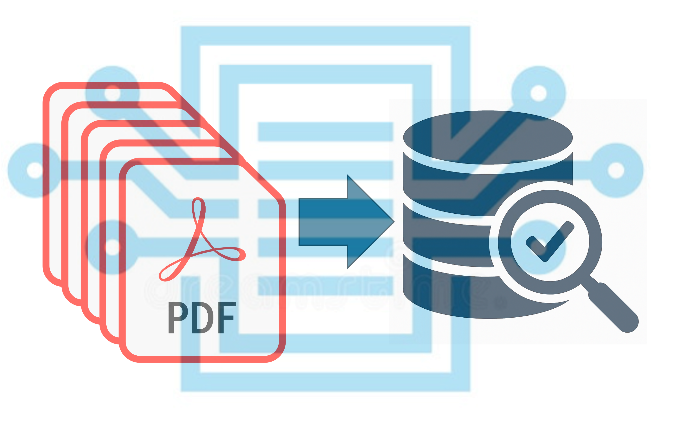

## 📦 Project Overview: PAnalytics Zenodo Archive System
[](https://doi.org/10.5281/zenodo.15460328)



This project automates the metadata preparation, validation, and upload of research artifacts (PDFs and other data files) to [Zenodo](https://zenodo.org/) under the `semanticsensors` community.

### ✅ Key Features Implemented

| Component              | Description                                                                 |
|------------------------|-----------------------------------------------------------------------------|
| `pdf/`                 | Stores publication PDFs, named by DOI                                       |
| `metadata/`            | Stores structured metadata JSON files (one per PDF)                         |
| `csv/`                 | Accepts spreadsheet-based metadata input via `metadata_input.csv`           |
| `scripts/csv_to_json_metadata.py` | Wizard that converts CSV rows to Zenodo-compatible JSON files     |
| `scripts/upload_batch_to_zenodo.py` | Secure uploader with rate limiting, retry logic, and logging     |
| `upload_log.csv`       | Logs every upload attempt with status, timestamps, errors, and Zenodo links |

### ⚙️ Technical Highlights

- ✅ Rate limiting (default: 7 days between uploads)
- ✅ DOI deduplication via Zenodo Search API
- ✅ Dry-run mode for safe testing
- ✅ Retry logic on transient upload failures
- ✅ Rich audit trail with success, skip, and failure states

### 🧪 For Collaborators

1. Drop your PDF in `pdf/`, named with its DOI
✔️ Note- Use : instead of / in the filename to avoid folder path issues
2. Fill in one row of `csv/metadata_input.csv` to match your record upload
✔️ Note- Script can auto-identify if you prefer not to manually input the record into csv
3. Project lead will run scripts and validate before upload

---

This system is optimized for transparent research archiving, minimal manual editing, and multi-user collaboration.

# SemanticSensors Zenodo Archive

This private GitHub repository manages the automated preparation and upload of academic files (PDFs, CSVs) to [Zenodo](https://zenodo.org/), under the `semanticsensors` community.

## 📁 Folder Structure

```
pdf/             → All PDF files to upload (named by DOI)
metadata/        → Matching JSON metadata files (from CSV wizard or manual prep)
scripts/         → Python automation scripts
upload_log.csv   → Auto-generated upload tracker
```

## ⚙️ Core Features

- ✅ Batch upload to Zenodo via API
- ✅ DOI deduplication with skip logic
- ✅ 7-day rate limiting (customizable)
- ✅ Dry-run mode and logging
- ✅ Metadata extraction from CSV (via `csv_to_json_metadata.py`)

## 🚀 Getting Started

1. Create a virtual environment:
   ```
   python3 -m venv .venv
   source .venv/bin/activate
   pip install -r requirements.txt
   ```

2. Set your Zenodo token:
   ```
   export ZENODO_TOKEN=your_token_here
   ```

3. Run the uploader:
   ```
   python scripts/upload_batch_to_zenodo.py
   ```

## 🧪 Development Notes

- All uploads are logged to `upload_log.csv`
- Metadata must be validated before submission
- Scripts support both manual and automated workflows

---

## 🧙 CSV Metadata Wizard

This repository supports team-friendly metadata preparation using a spreadsheet.

### Input

Fill in `csv/metadata_input.csv` with the following columns:

- `doi`, `title`, `creators` (required)
- `description`, `keywords`, `license`, `access_right`, `upload_type` (optional but recommended)

Example:

```csv
doi,title,creators,description,keywords,license,access_right,upload_type
10.1016/j.snb.2019.126822,Phosphate Sensor,Smith, J.; Doe, A.,Sensor detects PO4x-,phosphate,sensor,cc-by-4.0,open,publication
```

### Generate Metadata

Run this script to convert rows into Zenodo metadata JSON files:

```bash
python scripts/csv_to_json_metadata.py
```

This will produce:
```
metadata/10.1016:j.snb.2019.126822_metadata.json
```

You can then use the uploader to push all prepared metadata and PDFs to Zenodo.

© Managed by Eric McLamore and contributors.